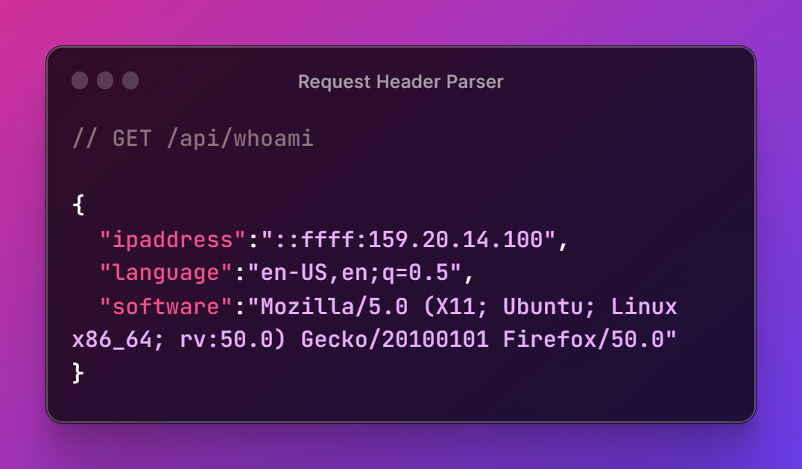
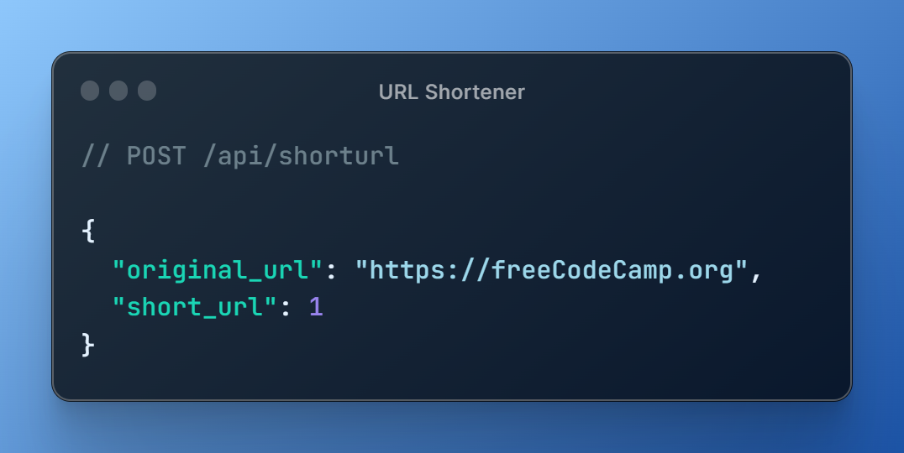
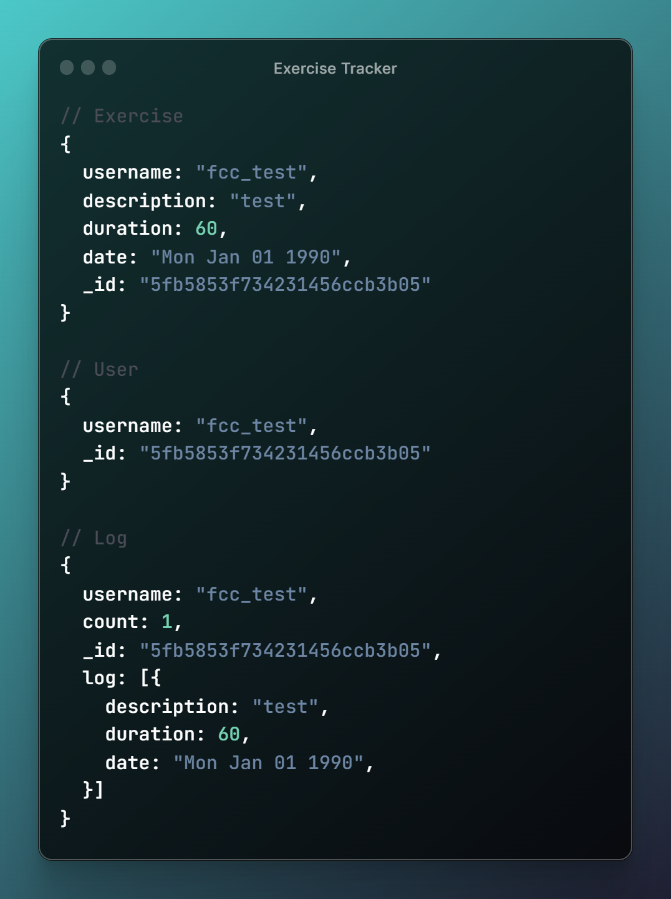
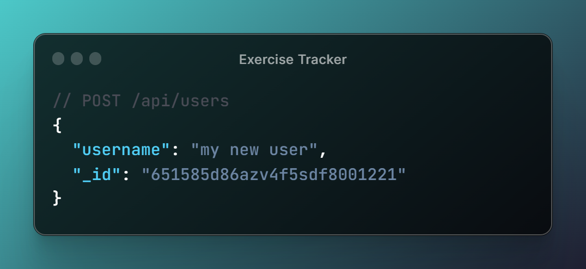
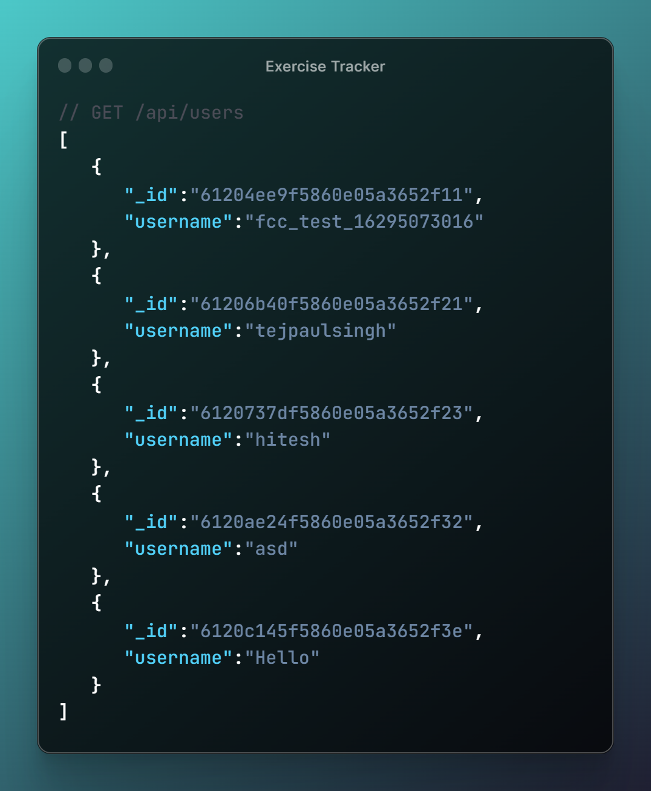
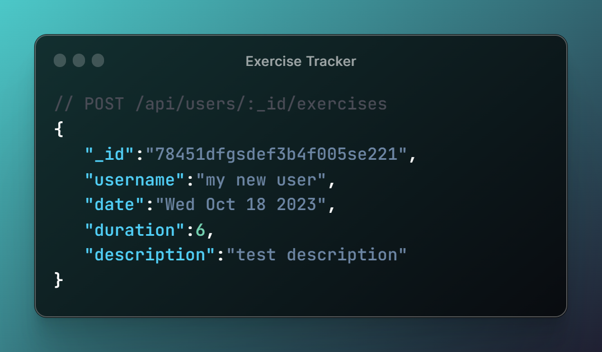
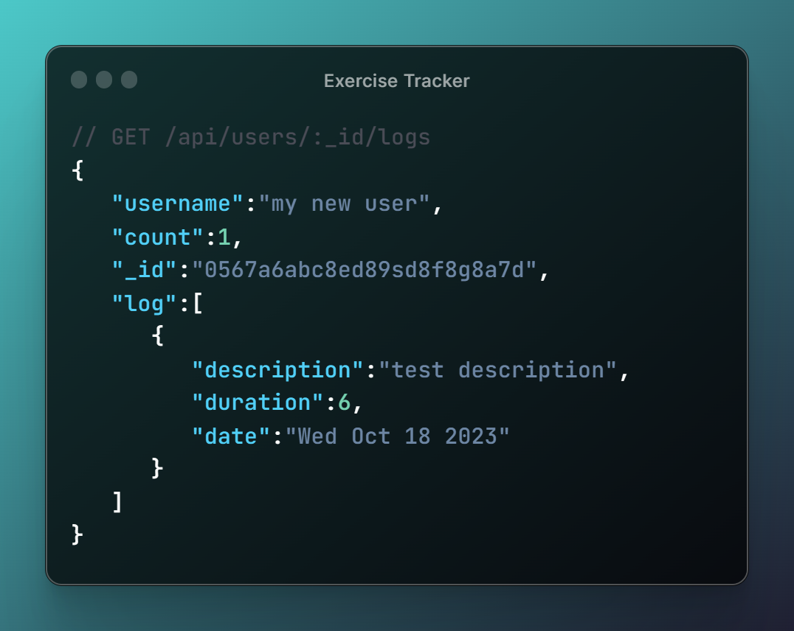
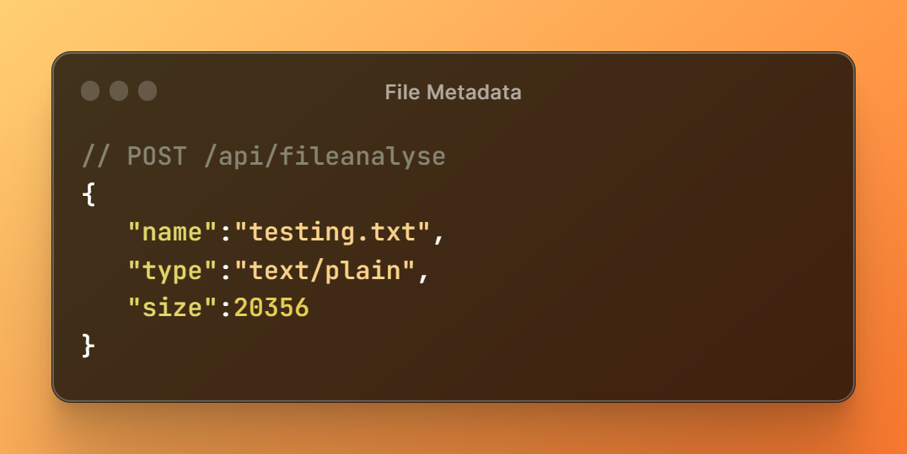

# FreeCodeCamp certification projects

# Timestamp Microservice

**Live Demo:** [Demo](https://timestamp-webservice.onrender.com/)

**Code:** [go to](https://shorturl.at/rHJNR)

[FreeCodeCamp description](https://www.freecodecamp.org/learn/back-end-development-and-apis/back-end-development-and-apis-projects/timestamp-microservice)

## Project Description

The Timestamp Microservice is a simple web service designed to handle date and time-related operations. It provides an API endpoint to convert between Unix timestamps and UTC date strings.

1. **Convert Unix Timestamp to UTC**

   - When making a request to `/api/:date?` with a valid date, the service should return a JSON object with a `unix` key. This key represents the Unix timestamp of the input date in milliseconds (as a Number).
   - The response should also include a `utc` key, which is a string representing the input date in the format: `Thu, 01 Jan 1970 00:00:00 GMT`.

  

2. **Invalid Date Handling**

If the input date string is invalid and cannot be parsed by JavaScript's new Date(date_string), the API should return an object with the structure: { "error": "Invalid Date" }.

 

3. **Empty Date Parameter**

When the date parameter is empty or not provided, the service should return the current time in a JSON object.
The response should include a unix key and a utc key, similar to the first test.

# Request Header Parser Microservice

**Live Demo:** [Header Parser Microservice Demo](https://headerparser-mhm9.onrender.com)

[FreeCodeCamp description](https://www.freecodecamp.org/learn/back-end-development-and-apis/back-end-development-and-apis-projects/request-header-parser-microservice)

**Code:** _tba_

## Project Description

The Request Header Parser Microservice is a web service that provides information about the client's request headers. It allows users to obtain details about their IP address, preferred language, and software used to make the request. The Request Header Parser Microservice is a useful tool for extracting essential information from client request headers, making it easy to analyze and respond to user requests with accurate data.

# URL Shortener Microservice

**Live Demo:** [URL Shortener Microservice Demo](https://shortener-service.onrender.com)

**Code:** _tba_

[FreeCodeCamp description](https://www.freecodecamp.org/learn/back-end-development-and-apis/back-end-development-and-apis-projects/url-shortener-microservice)

## Project Description

The URL Shortener Microservice is a web service that allows you to shorten long URLs. It provides an API endpoint to POST a URL and receive a JSON response containing both the original URL and a short URL for easy redirection. When you visit /api/shorturl/short_url, you will be redirected to the original URL.

**URL Shortening**
You can POST a URL to `/api/shorturl` and get a JSON response with `original_url` and `short_url` properties.

# Exercise Tracker

**Live Demo:** [Exercise Tracker Demo](https://exercise-tracker-service-13t3.onrender.com)

**Code:** _tba_

[FreeCodeCamp description](https://www.freecodecamp.org/learn/back-end-development-and-apis/back-end-development-and-apis-projects/exercise-tracker)

## Project Description

The Exercise Tracker is a web service that provides an API to create new users, record exercises, and retrieve exercise logs.

### Data models:

**API Endpoints**

1. Create a New User

- You can POST to /api/users with form data username to create a new user.
- The returned response from POST /api/users with form data username will be an object with username and \_id properties.

2. Get a List of All Users

- You can make a GET request to /api/users to get a list of all users.
- The GET request to /api/users returns an array.
- Each element in the array returned from GET /api/users is an object literal containing a user's username and \_id.

3. Record an Exercise

- You can POST to /api/users/:\_id/exercises with form data description, duration, and optionally date. If no date is supplied, the current date will be used.
- The response returned from POST /api/users/:\_id/exercises will be the user object with the exercise fields added.

4. Retrieve Exercise Log for a User

- You can make a GET request to /api/users/:\_id/logs to retrieve a full exercise log of any user.
- A request to a user's log GET /api/users/:\_id/logs returns a user object with a count property representing the number of exercises that belong to that user.
- A GET request to /api/users/:\_id/logs will return the user object with a log array of all the exercises added.
- Each item in the log array that is returned from GET /api/users/:\_id/logs is an object that should have description, duration, and date properties.

5. Retrieve Part of the Exercise Log

- You can add from, to, and limit parameters to a GET /api/users/:\_id/logs request to retrieve part of the logs of any user.

# File Metadata Microservice

**Live Demo:** [File Metadata Microservice Demo](https://file-metadata-service-2gje.onrender.com)

**Code:** _tba_

[FreeCodeCamp description](https://www.freecodecamp.org/learn/back-end-development-and-apis/back-end-development-and-apis-projects/file-metadata-microservice)

## Project Description

The File Metadata Microservice is a web service designed to handle file uploads and provide information about the uploaded files. It allows users to submit a form with a file and receive information about it, including its name, type, and size in bytes within the JSON response.

**File Information Response**
When you submit a file, you will receive the file name, type, and size in bytes within the JSON response.

