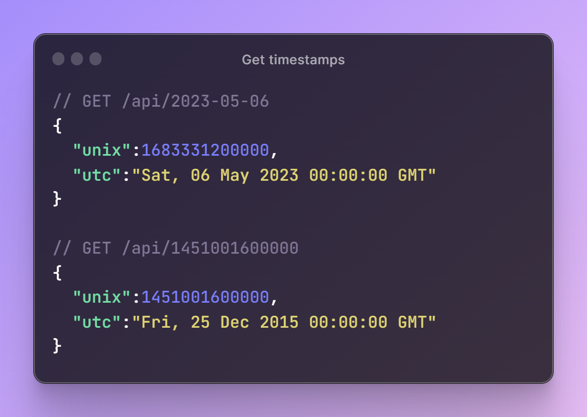
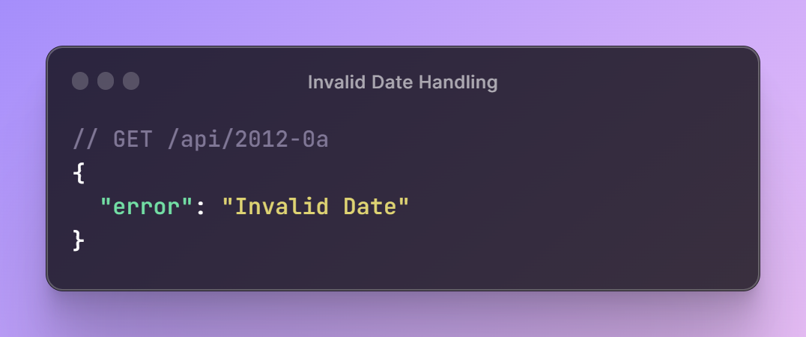
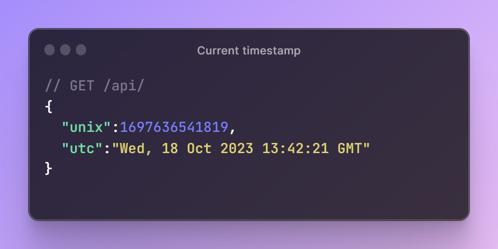

# FreeCodeCamp certification projects

# Timestamp Microservice

**Live Demo:** [Timestamp Microservice Demo](https://timestamp-webservice.onrender.com/)
[FreeCodeCamp description](https://www.freecodecamp.org/learn/back-end-development-and-apis/back-end-development-and-apis-projects/timestamp-microservice)

## Project Description

The Timestamp Microservice is a simple web service designed to handle date and time-related operations. It provides an API endpoint to convert between Unix timestamps and UTC date strings.

1. **Convert Unix Timestamp to UTC**

   - When making a request to `/api/:date?` with a valid date, the service should return a JSON object with a `unix` key. This key represents the Unix timestamp of the input date in milliseconds (as a Number).
   - The response should also include a `utc` key, which is a string representing the input date in the format: `Thu, 01 Jan 1970 00:00:00 GMT`.

  

2. **Invalid Date Handling**

If the input date string is invalid and cannot be parsed by JavaScript's new Date(date_string), the API should return an object with the structure: { "error": "Invalid Date" }.

 

3. **Empty Date Parameter**

When the date parameter is empty or not provided, the service should return the current time in a JSON object.
The response should include a unix key and a utc key, similar to the first test.

